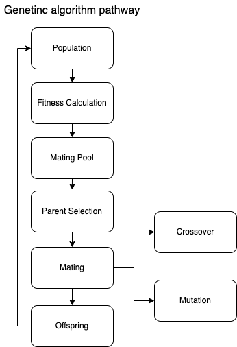

### three main characteristics:
1. Population Based
  - Designated to optmize a process in which current solutions are bad, and will generate new better solutions.
2. Fitness Oriented
  - There is a fitness value associated with solution, calculated from a fitness function. This value reflects how good solution is.
3. Variation Driven
  - Based on the fitness function, if there is no acceptable solution, we should make something to generate new better solutions, like a variation in the inputs.

### Glossary
  Population: Consiting of some solutions 
  Chromosome: Represented as a set of parameters (features) that defines the individual.
  Gene: Represented by somehow such as being represented as a string of 0 s and 1 s as in the next diagram

### Steps
1. Initialize population
2. Select parents by evaluating their fitness
3. Crossover parents to reproduce
4. Mutate the offsprings
5. Evaluate the offsprings
6. Merge offsprings with the main population and sort

### Two questions to be answered
1. How the two offsprings are generated from the two parents?
2. How each offsprings gets slightly change to be an individual?

### Chromosome Representation
- There are a lot of representations. The good representation is what makes the *search space smaller and thus easier search*.

Possible representations:
- Binary: reprensented as a string of zeros.
- Permutation: useful for ordering problems such as tavelling salesman
- Value: the actual value is encoded

Types of represetations

